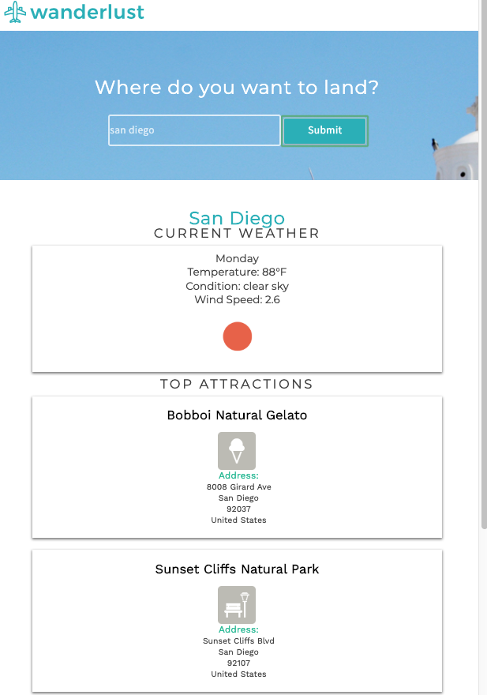

# wanderlust App

### **Description:**
Wanderlust is an application that displays top attractions for a specified city location. Simply type in the name of any major city in the world and the app will return current weather information for the area as well as a list of the things to do. This app makes GET requests from Foursquare and OpenWeather API's to return a JSON response which is then parsed, styled, and rendered to the page in an easy to read list format. 
 
_____

### **Instructions for Playing**
* Open app by visiting URL hosted in GitHub
* Type in the name of any major city and press the 'submit' button
* Use the returned information to explore the city you are visiting!
 
_____

### **Demo Screenshots**
##### Wanderlust
* Here's what the app looks like!

 
_________

### **Core Technologies Used**
* HTML5
* CSS
* JavaScript
* JQuery
* AJAX
* XML
* Foursquare API
* OpenWeather API
 
_____

### **Built With**
* Visual Studio Code
